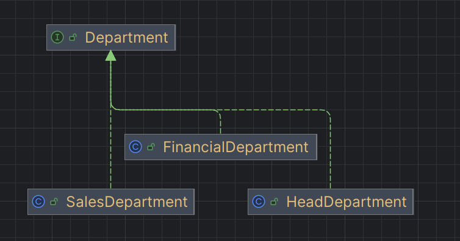

## Explicación de la implementación del Patrón Composite

El **patrón Composite** se utiliza cuando tenemos objetos que pueden estar compuestos por otros objetos similares, formando una estructura jerárquica como un árbol. Su objetivo principal es permitir que **tanto los objetos individuales como los compuestos se traten de la misma forma**.

En mi caso, implementé este patrón para modelar una organización de departamentos dentro de una empresa.

---

### 1. **Componente común (`Department`)**

Primero definí una interfaz llamada **`Department`**, que actúa como el *componente común*.
Esta interfaz declara el método `printDepartmentName()`, que es la operación que todos los departamentos deben implementar.

```java
public interface Department {
    void printDepartmentName();
}
```

 De esta manera, tanto los departamentos simples como los compuestos garantizan tener el mismo comportamiento base.

---

### 2. **Hojas (`SalesDepartment`, `FinancialDepartment`)**

Luego, creé clases que representan **departamentos simples** (las *hojas* del árbol):

* `SalesDepartment`
* `FinancialDepartment`

Estas clases implementan la interfaz `Department`, pero **no contienen otros subdepartamentos**, solo muestran su propio nombre cuando se llama a `printDepartmentName()`.

Ejemplo:

```java
public class SalesDepartment implements Department {
    private int id;
    private String namedepartment;

    public SalesDepartment(int id, String namedepartment) {
        this.id = id;
        this.namedepartment = namedepartment;
    }

    @Override
    public void printDepartmentName() {
        System.out.println(namedepartment);
    }
}
```

 Estas clases son las “hojas” del árbol, porque no pueden tener hijos.

---

### 3. **Composición (`HeadDepartment`)**

La clase **`HeadDepartment`** representa los **departamentos compuestos** (nodos internos del árbol).

Además de su propio `id` y `namedepartment`, tiene una lista de otros objetos `Department`. Eso significa que puede contener tanto hojas como otros `HeadDepartment` (subárboles).

```java
public class HeadDepartment implements Department {
    private int id;
    private String namedepartment;
    private List<Department> childDepartments = new ArrayList<>();

    public HeadDepartment(int id, String namedepartment) {
        this.id = id;
        this.namedepartment = namedepartment;
    }

    @Override
    public void printDepartmentName() {
        System.out.println(namedepartment);
        childDepartments.forEach(Department::printDepartmentName);
    }

    public void addDepartment(Department department) {
        childDepartments.add(department);
    }

    public void removeDepartment(Department department) {
        childDepartments.remove(department);
    }
}
```

 # Esta es la esencia del patrón Composite:

* `HeadDepartment` **implementa la misma interfaz `Department`** que las hojas.
* Internamente puede manejar otros departamentos (hojas o compuestos).
* Esto permite **tratar un objeto simple o compuesto de la misma manera**.

---

### 4. **Cliente (`CompositeSimulation`)**

En la clase `CompositeSimulation` actuamos como el **cliente** que usa la jerarquía.

* Creamos un `HeadDepartment` como el departamento principal.
* Agregamos como hijos un `SalesDepartment` y un `FinancialDepartment`.
* Usamos el método `printDepartmentName()` y automáticamente se recorren todos los hijos.
* Incluso permitimos agregar un nuevo departamento ingresado por el usuario.

```java
HeadDepartment headDepartment = new HeadDepartment(2, "Head Department");
Department salesDepartment = new SalesDepartment(1, "Sales Department");
Department financialDepartment = new FinancialDepartment(3, "Financial Department");

headDepartment.addDepartment(salesDepartment);
headDepartment.addDepartment(financialDepartment);

headDepartment.printDepartmentName();
```

 El cliente **no necesita distinguir si está trabajando con un departamento simple o compuesto**, solo usa la interfaz común `Department`.

---


La implementación sigue fielmente el patrón **Composite** porque:

1. Hay una interfaz común (`Department`) para todos los objetos.
2. Se definieron hojas (`SalesDepartment`, `FinancialDepartment`) que representan elementos simples.
3. Se definió un compuesto (`HeadDepartment`) que puede contener hijos, logrando la estructura jerárquica.
4. El cliente (`CompositeSimulation`) trata a los objetos individuales y compuestos de la misma forma, gracias a la interfaz común.

Esto permite que el sistema sea **flexible, extensible y jerárquico**, ideal para modelar estructuras organizacionales.


