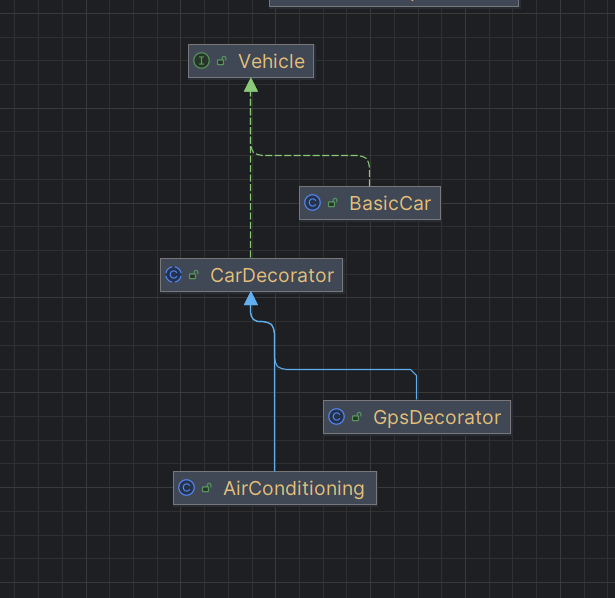

---

##  ¿Qué es el patrón Decorator?

El **patrón Decorator** permite **añadir responsabilidades adicionales a un objeto en tiempo de ejecución** sin modificar su clase original.
En vez de crear muchas subclases para cada combinación posible, usamos **decoradores** que envuelven al objeto original y le agregan nuevas funcionalidades.

---

##  Cómo se implemento en el código

1. **Componente base (interfaz)**

    * `Vehicle` es la interfaz que define el contrato para todos los vehículos:

      ```java
      public interface Vehicle {
          public String getDescription();
          public Double getCost();
      }
      ```

2. **Componente concreto**

    * `BasicCar` es el vehículo básico que implementa `Vehicle`:

      ```java
      public class BasicCar implements Vehicle {
          public String getDescription() { return "Carro basico"; }
          public Double getCost() { return 45500000.00; }
      }
      ```
    * este  el objeto **principal**, sin extras.

3. **Decorador abstracto**

    * `CarDecorator` implementa `Vehicle` y tiene una referencia a otro `Vehicle`:

      ```java
      public abstract class CarDecorator implements Vehicle {
          protected Vehicle vehicle;
          public CarDecorator(Vehicle vehicle) {
              this.vehicle = vehicle;
          }
          public String getDescription() { return vehicle.getDescription(); }
          public Double getCost() { return vehicle.getCost(); }
      }
      ```
    * Esto permite **extender el comportamiento** sin modificar el `BasicCar`.

4. **Decoradores concretos**

    * `AirConditioning` añade aire acondicionado:

      ```java
      public String getDescription() {
          return vehicle.getDescription() + ", con Aire acondicionado";
      }
      public Double getCost() {
          return vehicle.getCost() + 150000;
      }
      ```
    * `GpsDecorator` añade GPS:

      ```java
      public String getDescription() {
          return vehicle.getDescription() + ", con Gps";
      }
      public Double getCost() {
          return vehicle.getCost() + 450000.00;
      }
      ```

5. **Simulación del uso del patrón**

    * En `DecoratorSimulation` demuestras cómo se aplican los decoradores de forma dinámica:

      ```java
      Vehicle car = new BasicCar();
      System.out.println(car.getDescription() + " -> " + pcop.toCop(car.getCost()));
 
      car = new AirConditioning(car);
      System.out.println(car.getDescription() + " -> " + pcop.toCop(car.getCost()));
 
      car = new GpsDecorator(car);
      System.out.println(car.getDescription() + " -> " + pcop.toCop(car.getCost()));
      ```
    * Aquí empiezas con un carro básico, luego lo “envuelves” con aire acondicionado, y después lo “envuelves” otra vez con GPS.

---

##  Ejemplo de salida

```
Carro basico -> $45.500.000
Carro basico, con Aire acondicionado -> $45.650.000
Carro basico, con Aire acondicionado, con Gps -> $46.100.000
```

---

##  ¿Por qué es Decorator?

* Porque **no cambiaste la clase `BasicCar`**, sino que usaste objetos adicionales para **agregarle comportamiento nuevo**.
* Puedes combinar decoradores en cualquier orden (`new AirConditioning(new GpsDecorator(new BasicCar()))`) sin necesidad de crear nuevas subclases para cada variante.
* Sigues el **principio abierto/cerrado (OCP)**: tu clase `BasicCar` no cambia, pero puedes añadirle funcionalidades.

---

 **Explicación para tu exposición:**
"Implementé el patrón **Decorator** para extender dinámicamente las características de un vehículo.
La interfaz `Vehicle` define el contrato básico.
`BasicCar` es el componente concreto.
`CarDecorator` es la clase abstracta que me permite envolver un vehículo y extender sus funcionalidades.
Luego, con decoradores concretos como `AirConditioning` y `GpsDecorator`, agrego nuevas características sin modificar el `BasicCar`.
De esta forma, puedo crear combinaciones dinámicas de un carro con diferentes accesorios."


